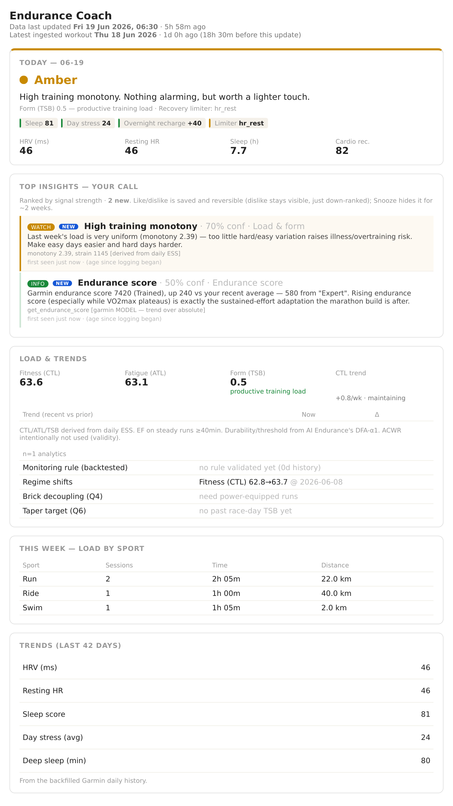

# personal-training-app — Endurance Coach

A personal AI coach for one triathlete/runner. It reads your plan, races and season calendar **live from
your AI Endurance account** (and optionally device data from **Garmin**), then *interprets* the data —
readiness, trends, race prep, small fixes — instead of just re-plotting it. Nothing about your calendar is
hard-coded: change your goals and the coaching follows on the next sync, with the season shape (taper
windows, don't-stack-peaks, a B-race that should be a capped tempo, the injury window when a run goal sits
off a triathlon base) **derived from whatever races you've set**.

> **Not medical advice.** This is a personal training tool, not a medical professional. Anything estimated
> is labelled a MODEL. For pain, injury, illness or any acute symptom (chest pain, breathlessness,
> dizziness, fainting, numbness, bleeding) the answer is to stop and see a qualified professional. It will
> never help with under-fuelling or weight-loss targets — fuel to train.

## See it in 30 seconds — no account, no key

```bash
npm install && npm run demo
```

`npm run demo` renders the full dashboard from **built-in sample data** — a fictional athlete, no account,
no Garmin, no API key, no network. The fastest way to see what the coach produces before you wire up
anything of your own.



<sub>Generated from the built-in sample data — regenerate with `npm run demo`, then `python3 scripts/render_dashboard_png.py reports/demo-dashboard.html docs/dashboard.png` (needs `weasyprint` + `pymupdf`).</sub>

> 📸 _Want to share your own? Run `npm run demo` and screenshot `reports/demo-dashboard.html` — the quickest pitch._

## What you need to run it for real

| | |
|---|---|
| **Node.js 20+** | `node --version` (from https://nodejs.org). |
| **A data source** | the spine the coach reads your plan, races and metrics from. **AI Endurance** is the default and most capable (https://aiendurance.com, a **paid** platform); **intervals.icu** is also supported (experimental, a thinner coach) — set `COACH_SOURCE=intervals`, see [docs/data-sources.md](docs/data-sources.md). **TrainingPeaks** has no personal API, but it syncs into intervals.icu, so TP users go via the intervals source. |
| **An Anthropic API key** | only for the **AI write-ups** (readiness / weekly / race / ask / …). The **dashboard, zones and health checks run with no key.** Pay-as-you-go — typically **~$5–10/month** on a daily coaching cadence; `npm run cost` shows your actual spend. https://console.anthropic.com |
| **Optional, all degradable** | Garmin device data, free Open-Meteo weather, a local LLM for cheap routing. Each is best-effort: if it's absent the matching card is simply omitted, never an error. |

**Setting it up:** the easy path is to point an AI assistant (Claude Code or similar) at the repo and say
*"follow SETUP.md"* — it runs the steps and stops to ask you for your accounts, units and training base.
By hand works too — [SETUP.md](./SETUP.md) is written for both, and `npm run setup` is a guided wizard
that writes your `.env`. Developed on macOS; the CLI + dashboard also run on Linux (only desktop notifications and
the auto-start installers are macOS-specific, and they no-op elsewhere).

## Everyday commands

First time: `npm run setup` (guided wizard → writes `.env`), then `npm run auth:aie`. After that, most
days only need:

```bash
npm start                    # run the coach (dashboard server) — open the printed localhost link
npm run demo                 # see the dashboard on sample data (no account/key)
npm run readiness            # today's green / amber / red verdict, with cited reasons
npm run weekly               # weekly review → a saved report
npm run tune                 # the small, easy wins to apply this week
npm run ask -- "how were my long rides this month?"   # ask your own data
npm run help                 # this short list any time (full reference below)
```

**→ Full command reference** — race prep, gated plan changes, deep dives, the research/knowledge
refresh, the MCP server for Claude, archiving, scheduling and the rest: **[docs/commands.md](docs/commands.md).**

The core loop (readiness / weekly / race / propose→confirm) is the product, and **every plan write is
gated**: `propose` only logs a change + its trade-off; nothing is written to AI Endurance until you
explicitly `confirm`.

**Deterministic safety guardrails (not just prompt instructions):**
- **Pre-LLM safety screen.** Free-text questions are screened in code *before* the model, in three classes:
  **acute medical symptoms** (chest pain, breathlessness, fainting, numbness, bleeding → stop and see a
  professional), **disordered-eating cues** (purging, skipping meals, food guilt → a non-judgmental support
  referral), and **restriction / "race weight" / deficit / weight-target** phrasings (→ adequate-fuelling
  targets). A standing clinical-boundary clause backs this inside every LLM prompt. A **rapid or unexplained
  weight drop is flagged as a health concern on its own** (never gated behind other signals, never a win),
  and that wellbeing escalation now shows on the **dashboard**, not just the CLI/MCP output.
- **Trend over single point — but not blind to a real alarm.** The green/amber/red call applies a
  code-level floor: a `red` is downgraded to `amber` unless **two** interpretable signals are out of line
  *or* there's a multi-day deterioration — so one bad night can't flip the call. Two exceptions keep it
  honest: a lone **high-specificity** signal (a big resting-HR spike, an HRV collapse, an orthopedic crash)
  stays red, and when the data is **too thin to confirm a one-off** the red is held (missing data never
  reads as "fine"). Weight rides along as a trend-only line.
- **Gated plan writes are bounded, not just targeted.** A proposed change must hit a real workout *and*
  pass safety bounds — no moving a session into the past, more than a year out, or onto/next to a race
  day; and any coaching-note text is run through the same wellbeing screen, so restriction/medical framing
  can't be written into the plan. Everything still goes through the explicit propose→confirm gate.
- **Observable unattended ping.** `ping` is idempotent per day (a re-fire won't double-notify or double-spend),
  records a success heartbeat, and **notifies you if it fails** instead of failing silently; `doctor` warns
  if the scheduled ping hasn't succeeded in over a day.

Garmin is **optional** — leave `GARMIN_ENABLED=false` and the coach runs on AI Endurance alone.
To enable it, run the one-time `garmin-mcp-auth` (see `.env.example`) then set `GARMIN_ENABLED=true`.

Layout: `src/mcp/` (AIE OAuth client + Garmin stdio client), `src/state/` (AthleteState, store,
baselines, sync-gaps), `knowledge/sports-science.md` (priors for the M3 LLM layer).

## Your athlete profile

The coach needs the **stable context no training API holds** — body and biomechanics, kit, medical
notes, availability, fuelling, your own race targets. That lives in a personal **athlete profile**,
served to coaching flows and to Claude (the `get_profile` MCP tool). **Live numbers — FTP, weight,
paces, swim CSS, HRV, training load — are *not* stored here**; they're pulled live from AI Endurance
and Garmin, and a schema guard rejects any live number that strays into the profile.

- **Two-file privacy split.** `profile.example.yaml` is the committed blank template; copy it to
  **`profile.local.yaml`** (gitignored, never shared) and fill in your own values. The app loads
  `profile.local.yaml` if present, else falls back to the example, and validates on load — failing
  loudly with a clear message if anything's malformed.
- **Setup.** `npm run setup` offers it, or run **`npm run profile:init`** directly. It **pre-fills from
  your connected integrations** — name and sex from AI Endurance, units/timezone from your `.env`, all
  upcoming races from your AI Endurance goals, a **MODEL estimate** of your weekly hours from recent
  training volume, and — when **Garmin is enabled** — your **date of birth and height** from Garmin's
  `get_user_profile` (stable identity AI Endurance doesn't hold). It then prints a summary and asks
  **"Does this look right? [Y/n]"**: **Y** keeps everything pulled and only prompts for the fields still
  genuinely missing; **n** drops you into the per-field flow (each prompt shows the pulled value as the
  default — Enter keeps it). **Date of birth is only asked when Garmin didn't supply it** (AI Endurance
  exposes your age, not your DOB). If AI Endurance is unreachable (or you haven't authed yet) it degrades
  cleanly to the full manual flow. Everything else — biomechanics, equipment, fuelling, medical — you
  fill in by hand. (Height is the only body number stored: stable anthropometry, never weight — weight
  stays a live number pulled from Garmin/AIE, and the schema guard rejects it in the profile.)
- **Re-running is a safe MERGE, not an overwrite.** If `profile.local.yaml` already exists, `profile:init`
  **updates it in place** — your hand-entered blocks (biomechanics, medication, equipment, bike-fit,
  fuelling, notes) are **kept**, and only the integration-sourced fields (identity, races, weekly hours)
  are refreshed; even hand-written race notes are carried across. It never rebuilds from the blank
  template, and if it can't parse your existing file it refuses rather than clobber it.
- **The optional extras, explained.** Run **`npm run profile:questions`** for the list of optional
  profile fields you can fill whenever you like — each with a plain-language question and a one-line
  *why it changes your coaching* (e.g. medication timing drives the dose-cycle the coach plans around;
  leg-length/cleat inform run-load and injury notes; fuelling targets feed race advice). Everything
  there stays optional. Also rendered as [docs/profile-questions.md](docs/profile-questions.md).
- **Three ways to fill it.** The wizard (`npm run profile:init`), editing `profile.local.yaml` by hand,
  or **by talking to Claude** — the MCP `update_profile` tool patches your answers straight into the file
  (validated; live numbers rejected). It's on for local **Claude Desktop/Code**; on **Cowork** set
  `COACH_MCP_PROFILE_WRITE=true` to allow it (it writes a file on your Mac from a remote session).
- **Read & edit your local files from Claude.** Beyond the profile, the MCP `list_files` / `read_file` /
  `write_file` tools let Claude browse and update the project's **gitignored** files — `profile.local.yaml`,
  `data/`, `reports/`, `knowledge/` — that a cloud session's fresh clone doesn't have on disk. On for local
  **Claude Desktop/Code**; on **Cowork** set `COACH_MCP_FILE_ACCESS=true`. **Hard-scoped to the repo with a
  secrets deny-list**: `.env*`, token/key files, `.git/` and `node_modules/` are never readable or writable,
  whatever the flag. See [docs/mcp-server.md](docs/mcp-server.md).
- **Bike race weight.** Log each bike as-raced (incl. a bottle) under `equipment.bikes.<name>.race_weight_g`
  in **grams** — a `weight_kg`/`weight` is rejected as your live bodyweight, but a bike's own mass is stable
  kit, so grams passes. The coach surfaces it in the live block and adds your **live** weight to it for total
  system weight (rider + bike) — e.g. to size tyre pressure. The rider half stays live; only the bike half is
  stored. `profile.example.yaml` carries a commented `felt:` block to copy.
- **Blood panels — dated snapshots.** `bloods.panels` is the one place the profile keeps clinical numbers,
  on purpose: the no-live-numbers rule guards values a live API *owns* (FTP, weight, HRV…), but **no API
  holds your bloods**, so a dated panel is stable context that lives nowhere else. Each entry is a
  snapshot (`date`, `source`, free-form `markers`, `flags`, `notes`). It's always treated as a *snapshot,
  never as current* — the coach surfaces the **latest** panel with its **age** and a *re-test* nudge once
  it's over a year old, shows full markers via `get_profile`, and the guard still rejects a live-metric
  key (e.g. `resting_hr`) snuck in among the markers. `profile.example.yaml` carries a commented panel to
  copy. (It's not medical advice — record what your report and GP tell you, then the coach factors it in.)
- **`dose_cycle`.** If you set `health.medication.dose_day` + `gi_trough_days`, `get_profile` returns a
  computed `dose_cycle` (`days_since_dose`, `in_gi_trough`) so the coach can keep your hardest/longest
  sessions off the GI-trough days and watch under-fuelling — the personalisation a generic endurance
  MCP can't do. (Medication boundaries are the prescriber's call; the coach works *around* it.)
- **What this app can't set for you.** This connector is **read-only to AI Endurance**, so it can't
  write your **swim CSS or FTP** there — set those directly in the AI Endurance app. The profile's
  `ai_endurance_todo` block is a reminder, not a write path. (Race *target times* aren't on it — AIE has
  no field for them; they live in `races[].target_time` and the coach reads them from the profile.) It
  *can* now **compute** your swim CSS from a 400/200 test (the `splits` tool / `npm run splits`) and
  recommend the number — with a maximal-effort confidence check — but applying it stays your manual step.
- **A "Set up & improve" card on the dashboard.** A small, deterministic (no-AI) action hub in three
  sections: **Finish setup** (actionable AI-Endurance gaps, your free-text `open_items`, unfilled optional
  profile questions, a few **integration-health** nudges — missing API key, long-stale sync, unset
  open-water temp — and any **race with no date yet**), **This week** (the marginal-gains tweaks *not
  already in Top insights* + the action items from your last weekly review) and **Worth considering**
  (items from your last research digest — each one says **what the research found**, names its **source**,
  links to **read the full digest** in-app, and gives the **one concrete command** to fold it into the
  coach's priors). **Everything in "This week" is actioned right on the card —
  it never points you at a saved report.** Each advice item leads with the plain-English action (the tech
  detail sits muted underneath) and carries a category chip (*Training / Fuelling / Gear / Recovery*):
  - a **fuelling, gear or recovery** change gets **👍 Agree / 👎 Disagree / 💤 Snooze** (reversible) plus
    **🚫 Ignore** (a permanent "don't show this again", distinct from the ~2-week snooze) — the same logged
    feedback the Top-insights box uses. These reactions **feed the listening model the same way a top-box
    reaction does**: a 👍/👎 on a card now reshapes that finding-family's ranking weight (it used to be
    recorded but dropped on the floor);
  - a **training plan edit** gets **➡️ Make this change**, which drafts the concrete edit and applies it to
    your plan in AI Endurance through the **gated propose→confirm write** (you confirm the exact change
    first; it's logged and reversible). If it can't be tied to a scheduled session, you get the **precise
    steps** to make it yourself in AI Endurance or Garmin instead — never a dead end. **Once you've applied
    a change, the card marks itself ✓ applied** (recorded against the card, so it survives a reload) and
    stops re-offering "Make this change" — the gated write is permanent, the card just reflects it.

  An `open_items` entry that just restates a setup gap (e.g. a hand-written "swim CSS not set" alongside the
  `swim_css` gap) folds into the canonical item, so each gap is listed once. **A gap the live data already
  satisfies auto-clears** — once your **swim CSS** is set in AI Endurance and synced, the "Set your swim CSS"
  task (and any open-item restatement of it) just disappears, no click needed. (FTP is deliberately *not*
  auto-cleared: its gap is a Garmin-vs-AIE *disagreement*, not an absence, so a value being present doesn't
  mean it's resolved.) The time-bound sections **read your last saved reports** — they never re-run the
  weekly/research LLM flows — and each carries an *"as of …"* tag, dropping once the report goes stale.
  **Finish-setup** tasks stay plain `<details>` rows tagged with where to action them (*in AI Endurance* /
  *edit profile* / *in your setup*), each expandable to a concrete, copy-pasteable how-to, and each carries
  **three distinct actions** (the old single ✕ only ever snoozed):
  - **✓ Done** — "I've done this": hidden for good, and remembered. For an **AI-Endurance gap** the server
    also writes it `resolved` back into your `profile.local.yaml`, so it stays gone across rebuilds — not
    just suppressed in the log.
  - **💤 Snooze** — "not now": hidden ~2 weeks, then it can resurface (re-snoozing it is how the coach
    notices a task that keeps coming back).
  - **🚫 Ignore** — "ignore this advice": dropped for good, without touching your profile.

  Everything is **ranked by value**, deduped and capped (a calm hub, not a nag). Display-only; hidden from
  the shared/screenshot view.
- **A "Data changes — your call" card.** When AI Endurance or Garmin **auto-update** a number the coach
  relies on — bike FTP, threshold HR/pace, swim CSS, **max HR**, VO₂max — the dashboard surfaces it (*"Bike
  FTP 250 → 262 W · Garmin · as of 3d ago"*) so it isn't a silent change. Neither platform exposes a
  notification feed, so this is **diffed from your own daily snapshots** (deterministic, no LLM). Each change
  carries **👍 agree / 👎 disagree / 💤 snooze**, reusing the insights' feedback machinery (zones follow from
  the thresholds). **👎 disagree pins your own value** as a local override the next sync honours —
  *conditionally*: it holds only while the platform keeps reporting the value you rejected, so if it later
  detects something new that resurfaces for a fresh call. The card also flags when the **two platforms
  currently disagree** (*"Bike FTP · AI Endurance 250 W vs Garmin 235 W · using AI Endurance 250 W"*) with a
  one-tap **⚖️ use the other source** that pins it the same way. Active pins are listed with an **un-pin**
  (accept the auto value). Overrides live in the gitignored data dir, never the profile.
- **The coaching brief ships as a default prompt.** [`coach-instructions.md`](coach-instructions.md)
  is the default system prompt a fresh clone gets (a prompt, *not* data — kept separate from the
  profile); edit it to taste. Full schema + privacy detail: [docs/profile.md](docs/profile.md).

## The insight engine (n=1 analytics)

A deterministic statistical layer — **no LLM, no cost** — answers a set of pre-registered analytical
questions (a data-scientist brief, Q1–Q7) from your own history, with honest uncertainty:
autocorrelation-aware correlations (Fisher-z CIs, FDR-controlled), out-of-sample-validated HRV/RHR
monitoring rules, change-point detection, brick decoupling, taper-target form bands, economy-vs-fitness
separation, an under-fuelling red flag, and `.FIT` stream analysis (thermal + in-session biomechanics).
Your full physio history (HRV, resting HR, sleep, stress, Body-Battery, respiration, body composition) is
**held in detail but kept quiet** — each stream has its own watcher that only speaks up on a **worrying
trend** (illness signals stacking, deep- or total-sleep slipping, stress chronically high, recovery not
recharging, weight + muscle falling together), a **danger** (a rapid weight drop, flagged on its own), or a
**possible data error** — a uniform data-quality check that surfaces any reading outside the plausible
human range, an impossible overnight body-comp jump, or a flatlined/stale sensor, so a bad measurement
can't silently corrupt the trend it feeds. Each detector self-gates until there's enough of your data
behind it, every finding carries a confidence score, and anything estimated is labelled a MODEL. Surfaced
in `deep-dive`, `ask` and the dashboard **Signals** / **Top insights** cards.

The **Top insights** card also closes a feedback loop: 👍/👎/💤 on each finding is saved and reversible,
down-ranks or lifts its family **within a severity tier** (flags are never buried), and `npm run listening`
prints your engagement model — what you act on vs dismiss, plan adherence (deferring to AI Endurance) and
plan changes diffed from daily snapshots. The loop now spans the whole hub, not just the top box:
**reactions on the "This week" cards count toward their family weight too** (a `setup:*` card carries its
finding family so the listening model can attribute it), and your **gated plan-proposal accept/decline
history** feeds back into the proposer — decline most of them and it turns conservative (smallest viable
change, or nothing), rather than re-pitching edits you keep waving off. The **weekly review and research
digest** read the same signal: they're told which families you set aside and stop re-pitching them. And you
can record a **retrospective** on any insight (`retrospect` MCP tool) — *did it hold up?* — which `listening`
joins back into an **"Outcomes you recorded"** view (insight → your reaction → outcome), so the loop answers
"what advice did I get, what did I do, and did it work" — not just "what was I shown". The LLM write-ups join
the loop too: **readiness, deep-dive and `ask` each tag a short list of family-labelled recommendations**,
surfaced as individually reactable cards on the dashboard's **Coach's recommendations** card (and reactable by
key via MCP) — so a 👍/👎/🚫 on a coaching suggestion shapes the same family weights and is retrospect-able like
any finding. (`ask` emits the prose answer and its recommendations in one structured call, so there's no extra cost.)

**→ Full detail — the Q1–Q7 methods, the like/dislike/snooze mechanics and the engagement loop:
[docs/insight-engine.md](docs/insight-engine.md).**

## Deep session feedback

Deep feedback is **generated automatically at sync for every session** (no button) and **persisted** — so
the dashboard's **Last session** card shows it **inline** (rendering a stored readout makes no LLM call),
and the history is kept for later analysis (`data/session-feedback.jsonl`). When the latest session has no
stored readout yet, the card fetches one on page load (see below) rather than showing a static placeholder. Generation is best-effort and cost-aware: it runs
once per session after `fit-sync` has pulled the raw **.FIT** (so it's a real deep dive), is API-key-gated,
cost-logged, and capped per sync; a session without its .FIT yet is picked up on a later sync (skipped
cheaply, no tokens). Since each session generated is one LLM call, **`COACH_AUTO_SESSION_FEEDBACK`** throttles
it — `on` (default, every recent session), `latest` (only the most recent), or `off` (none — use
`npm run session` on demand instead). `npm run session` always produces an on-demand readout (and writes to the same store).
The card also shows what the session was **meant to be** — the matching
planned workout (title, planned vs done time), or an explicit note when nothing in the plan matched. It
joins your **AI Endurance metrics** (power/HR/ESS/durability) with the
**.FIT biomechanics** (in-session cadence/GCT/vertical-osc drift, aerobic decoupling, temperature) and the
**archive thermal summary**, then reads it against your **prior comparable sessions** and that day's **TSB**
— so a dip in deep fatigue or heat isn't mistaken for lost fitness. It also reads your **upcoming 7 days
of planned sessions** and says what (if anything) this session should change ahead — suggestions only;
plan writes stay behind the gated two-step confirm. "What happened in my last run?" in the Ask box routes
here automatically. Routing has three strategies via `COACH_INTENT_ROUTER` (all degrade to the regex on
any error): **`regex`** (default, zero-cost, no model); **`haiku`** — the recommended upgrade — a cheap
`claude-haiku-4-5` micro-call on your existing `ANTHROPIC_API_KEY` (no extra server) that catches
paraphrases the regex misses ("break down Tuesday's ride") for a fraction of a cent, cost-logged like any
call; and **`local`** (advanced) — the separate `local-llm-server` (Ollama) wrapper for zero API cost.
It is used only for this low-stakes routing — coaching output always stays on Opus, and any failure falls
back to the regex, never blocking the Q&A.

**The deep dive only runs with the session's raw `.FIT` stream** — without it there are no biomechanics
to read, so the LLM call is skipped (zero cost). The stream now **auto-downloads**: the dashboard Sync,
the MCP `sync` tool and `fit-sync` all pull recent ones into `data/fit-streams/`.

**If the latest session has no readout yet when you open the dashboard, the card fetches it for you on
load** — no waiting for the next full sync. It shows the live state instead of a static line: *"Downloading
this session's .FIT and generating deep feedback…"* (it pulls the raw `.FIT` on demand, ~10s, when it isn't
local but the archive knows the Garmin id), or *"Generating…"* when the `.FIT` is already present. The
result is rendered inline **and persisted**, so the next open is instant with no further LLM spend.
Concurrent requests for the same session (e.g. two tabs opened together) are **coalesced into one
generate** — the download + LLM call run once and both await it, never a double spend. A stale
snapshot (older than `COACH_AUTOSYNC_MIN`) still kicks a full background Sync instead, which downloads and
backfills the same way before reloading. The card only falls back to a note — never a spinner that goes
nowhere — when it genuinely can't produce one: *no `ANTHROPIC_API_KEY`*, or *no `.FIT` and no automatic way
to fetch it* (Garmin off, an old `garmin_mcp` build, or no archived activity id), in which case export the
original `.FIT` manually (Garmin Connect → ⚙ → *Export Original*) and drop it into `data/fit-streams/`. The
**`ingest_fit` tool** (`npm run ingest-fit <path>`) validates a dropped/exported `.FIT` and confirms it's
now readable; with no argument it reports what's in the watched dir. To analyse from summary data anyway:
`npm run session -- --force`. Ask-box questions fall back to general Q&A instead.

**Multiple sessions in a day?** The card names exactly which session it's showing and, on a day with more
than one activity (a brick, or a triathlete's swim + ride + run), notes how many there were — it shows your
**longest** activity by default but no longer silently hides the rest. Each session also shows its **start
time** (in the heading and on every switcher chip) so same-day sessions are easy to tell apart at a glance.
The time comes from the synced **.FIT** stream and is shown in your local timezone (`COACH_TZ` → profile
`identity.timezone` → Europe/London); a session without a stream shows the **date only**, never a guessed
clock. A **session switcher** under the card lists your recent sessions (one chip per distinct session); tap
any to **dive into its deep feedback** in place — served inline if it's stored, otherwise generated once and
persisted like the latest.

Because AI Endurance activities carry **no stable per-activity id** (only a date), sessions are identified
by a **composite key — date + sport + rounded duration**. That separates not just a multi-sport day (swim +
ride + run) but **two of the same sport in one day** (a double-run day, a recovery spin + the main ride):
each gets its own chip and its own readout. The deep dive then **best-matches each session to its own `.FIT`
stream by duration** (a fuzzy record-link, since there's no shared id), so the shorter session reads its own
biomechanics and start time rather than the longer one's. The only residual case — two same-sport sessions
of the *same* rounded duration with no `.FIT` to separate them — is rare; they collapse to one, and the card
says how many sessions ran that day so nothing is silently hidden.

**Bike L/R power balance** is decoded honestly: Garmin packs left/right balance with a flag bit, so read
raw a left-leaning stroke can surface as an impossible *174%*. The parser masks the flag and reports the
**left-side share** against a 50% = even reference (e.g. that 174 is really ~54/46) — so the readout never
mistakes a normal mild asymmetry for a power-meter fault, and a value still outside 0–100 is labelled a
sensor/encoding artifact rather than analysed.

When the `.FIT` *is* present, the deep dive now also reads the **run dynamics** the chest strap records —
vertical ratio, step length and GCT (stance-time) L/R balance — and, on the bike, **normalized power**
(with its variability index vs average) and **L/R power balance** from the pedals. These were decoded but
previously dropped before the readout; each is omitted (never faked) when the device didn't record it.

**A missing `.FIT` is now loud, not silent.** `sync` / `get_state` / `npm run state` print a
**data-completeness** line: when a recent session's raw `.FIT` isn't present (so its per-interval splits
and biomechanics are unreachable), it's named explicitly with the reason — Garmin disabled, not reachable
(re-auth), the `download_activity_file` capability absent, or a download that *attempted and failed*
(the reason is surfaced, no longer swallowed). A clean sync no longer hides a missing stream.

## Fuelling guidance (from the nutrition you actually use)

Tell the coach what's in your nutrition cupboard once, and it gives **per-session fuelling** — pre,
during and after — built from *your own* products, not generic advice. It is deliberately quiet: a short
easy run returns **"nothing needed — water's fine"**, and pre/during/after sections appear only when a
session's duration, intensity (and the day's forecast heat) actually cross a threshold.

**1 — Log your inventory** (once, in `profile.local.yaml`). Each product is per-serving; `category` is one
of `drink_mix | gel | chew | bar | real_food | electrolyte | recovery | nitrate | caffeine | supplement`
(omit it and it's inferred from the name). See `profile.example.yaml` for the full format:

```yaml
fuelling:
  products:
    - { name: Beta Fuel Gel, brand: SIS, category: gel, serving: "1 gel", carbs_g: 40 }
    - { name: Flapjack, brand: Flapjack Co, category: bar, serving: "1 bar (120 g)", carbs_g: 65 }
    - { name: 5 Electrolytes (Lemon), brand: PowerBar, category: electrolyte, caffeine_mg: 75 }
    - { name: REGO Whey, brand: SIS, category: recovery, serving: "1 scoop", protein_g: 21, carbs_g: 4 }
    - { name: Beet It RE:GEN, brand: Beet It, category: nitrate }
    - { name: Beta-Alanine, brand: XXL, category: supplement, timing: [daily] }
```

**2 — See it on the dashboard.** The **"Fuelling — next session"** card shows just the *next* session's
plan, short and sharp — pre/during/after as one line each (e.g. a 3 h endurance ride gets `During ~75 g
carb/hr (≈225 g): 3× Flapjack · ~500 ml/hr + an electrolyte tab` and a recovery line), or a single
"water's fine" line when nothing's needed. It auto-picks your **caffeine-free** electrolyte for an evening
session, scales fluid/sodium up in heat, and respects your **learned carb/hr ceiling**; daily supplements,
the model assumptions and the "Review my fuelling" button tuck behind a **More** disclosure. Everything is
labelled a MODEL. On the terminal `npm run fuelling` prints the whole week's plans; from Claude/MCP the
`fuelling` tool does too.

Until you add an inventory it stays out of your way: the card shows a one-line nudge with the format, and
the **"Set up & improve → Finish setup"** card lists "what nutrition do you use?" as an open item (it's an
optional profile question like the rest — see `npm run profile:questions`). Nothing breaks; it's an empty
inventory waiting on you.

**3 — Close the loop.** Tap **👍 went well / 👎 felt rough** on a session's plan (or call `log_fuel`); it
appends one line to a local `data/fuel-log.jsonl`. Once you've logged a few, **"Review my fuelling"** (the
`fuel_review` tool) reads them back and tunes the model to *you* — your real carb/hr tolerance, what sits
well on the bike vs running, caffeine timing — and suggests `fuelling.preferences` values to set. It's
n=1 and descriptive (a MODEL), **wellbeing-screened** (about fuelling *enough* for the work — never
restriction, deficits or weight targets), and needs ≥3 logged sessions before it'll say anything.

## Marginal gains + keeping the knowledge current

Two flows answer "what small thing can I improve?" and "is the coach's thinking up to date?" — on a
weekly/monthly rhythm.

**`npm run tune` (weekly) — marginal gains.** The Top-insights card and `deep-dive` lead on the big calls
(load, ramp, injury). The tune-up does the opposite: it deliberately surfaces the **smaller, low-effort,
specific** findings that carry a concrete recommendation — efficiency, durability, fuelling, pacing,
biomechanics — and turns the strongest few into 2–4 tweaks you can apply this week. Deterministic selection
(excludes flags and the macro load/injury families) + one cheap LLM phrasing pass.

**`npm run research` (monthly) — refresh the knowledge layer.** The coach's priors live in
`knowledge/sports-science.md`, loaded into *every* prompt — so they're only as current as that file. This
flow **web-searches recent training / triathlon / gear thinking** (e.g. the wider-tyre shift, fuelling g/h
creep, heat protocols) against the current priors and **drafts a proposed update** into
`knowledge/pending/`. It is **review-gated**: nothing is applied until you read it and run
`npm run knowledge -- approve <file>`, which folds it in under a dated section and bumps the verified date.
`npm run knowledge` shows freshness (flagged **stale after ~35 days**) and any digests awaiting review.
On the dashboard, a fresh digest also surfaces in the **"Worth considering"** card — each item shows what
the research found and its source, and the card links to a **read-only in-app view of the full digest**
(`/digest`) so you can read the proposal without leaving the dashboard or hunting for the file. That page
renders the proposal as **formatted markdown** (headings, lists, quoted study excerpts) with every
**source linked to the original** — bare DOIs are turned into `doi.org` links so the paper is one click
away — and the `approve` command shown there is **filled in with the real file name** (copy-paste, no
`<file>` to swap). Each source carries a resolvable DOI/URL, and the model's own search commentary is kept
out of the saved digest.

This is the one flow that reaches the public web (via the model's web search — best-effort and cost-logged;
a failure leaves the priors untouched). The guardrails hold throughout: **priors are hypotheses that yield
to your own n=1 data**, no clinical claims, fuel-to-train. All three are also MCP tools (`tune`, `research`,
`knowledge`) for Cowork — though `approve` stays a deliberate CLI action, never an agent's call.

## Token cost (know — and control — what you spend)

Every LLM call's token usage + dollar cost is logged locally (`data/cost-log.jsonl` — counts and cost only,
no prompt text). `npm run cost` reports spend by flow over today / 7d / 30d / all-time with a monthly
projection (the dashboard stays decluttered — cost lives in `npm run cost` / the MCP `cost` tool, not a card). To keep it down, the cheap, frequent flows
(`ask`, `readiness`, `session`) run at `effort: "medium"` while the deep flows (`weekly`, `race`,
`deep-dive`, plan proposals) stay `"high"`. Rates are configurable in `src/config.ts` (`COACH_PRICE_*`).

## Zones, thresholds & race splits

- **Zones & thresholds** card, grouped 🏊 swim / 🚴 bike / 🏃 run for clear separation, plus your headline
  numbers — **bike FTP (W and W/kg), run threshold pace + LTHR, swim CSS**. Pulled from `getUser`; where
  only thresholds are exposed, zones are derived with standard models (Coggan power, %-LTHR, %-threshold
  pace). **Swim CSS and run threshold pace** are read whether AI Endurance returns them as a **pace
  string** (`1:52`, `4:50`) or a speed; if swim CSS isn't exposed via `getUser` at all, set
  **`COACH_SWIM_CSS`** (m:ss or seconds) as a manual fallback so the swim model still populates (the
  platform's value always wins when present). **Bike HR zones** use your bike LTHR when the profile exposes one, else fall back to run LTHR
  with a visible note (bike LTHR typically sits a few bpm lower — treat zone tops conservatively).
  When Garmin's **power-duration FTP *estimate*** (in the Garmin scores card) sits materially below your
  configured bike FTP, the card flags the gap rather than leaving two conflicting numbers on the page:
  the MMP curve only sees power-equipped rides and revises up only on hard, sustained power efforts, so a
  low estimate is a floor, not a downgrade — your **configured FTP** is what drives the zones. To dig into
  that gap (e.g. **223 W configured vs ~183 W estimated**), run **`npm run ftp-check`** (or the `ftp_check`
  MCP tool): it lays the two figures side by side with your recent **power-meter coverage** and recommends
  closing the gap with power-equipped rides — and is honest that, read-only, it can't see *which* engine
  set AI Endurance's FTP, so it asks you to verify the source rather than guessing.
- **Estimated race splits** for every upcoming race — shown as a **finish-time range**, not a single number:
  - **The range** is *race-day best → race-it-today*. The worst case is your current prediction (racing at
    today's fitness). The best case is **predicted from doing the planned training well** — a bounded,
    horizon-driven MODEL: the more **weeks you have to build** before a race, the larger the realistic
    improvement, with diminishing returns and a hard ceiling (~7%, even for a long season). It's gated on
    actually having training ahead (an upcoming plan, or fitness not in decline), so a detraining athlete
    with nothing planned gets no free upside. When there's nothing to build toward, it falls back to **your
    own recent rate of improvement** in race predictions (only when that trend is statistically reliable),
    and otherwise the range collapses to your current level — never an empty promise. Both ends are labelled
    a MODEL with the assumptions stated. **Both estimates are always shown** (race-day best and
    race-it-today, side by side), even when they currently match. Because each race is a different number of
    weeks out, the best case **differs per race** — a race months away has more room than one in a fortnight.
    The caveats every race shares (the build assumptions, and the fixed-transition / durability / missing-leg
    notes) are shown **once** in an *"Applies to all races"* line rather than repeated under each race.
    Times are rounded to the minute; each card leads with the race **date + countdown** and a glossary.
    (Earlier versions tried to roll your plan's load forward into a projected fitness/CTL number; that was
    too sensitive to plan-data quirks and over-projected, so it was replaced by this bounded curve. Tune the
    ceiling and time-constant via `MAX_PROJECTED_GAIN` / `BUILD_TAU_WEEKS` in `src/insights/splits.ts`.)
  - **The per-segment table** shows both the **Split** (time for that segment alone) and the **Cumulative**
    (running total), so you can pace each leg/kilometre as well as see the overall clock. Splits sum exactly
    to the finish.
  - **Run races**: AI Endurance's predicted finish broken into a per-segment pacing plan, shaped by your
    **durability trend** — improving durability earns a gentle negative split; weak/unknown durability gets
    a conservative start that protects against the late fade.
  - **Triathlons** (sprint/Olympic/70.3/IM, detected from the goal's name/type): per-leg
    swim/T1/bike/T2/run estimates from your **current numbers** — swim from CSS, bike from FTP at the
    format's standard intensity (power → flat-course speed via a physics model), run from your standalone
    Garmin run prediction with an off-the-bike penalty (threshold-pace fallback), plus fixed transition
    estimates. A leg whose input is missing (e.g. no CSS set) is named as missing, never invented.

  (Predicted times are MODEL estimates — the plan is a target, not a guarantee.)

## Online dashboard (view it on your phone over Wi-Fi)

A small local web server serves the live dashboard. **It is bound to `localhost` by default** and every
route (incl. the AI Endurance write path) requires a per-install **pairing token** — the server exposes
writes + LLM spend, so it is not left open. To reach it from your **phone on the same Wi-Fi**, set
`COACH_LAN=1`. Credentials never leave the Mac.

**Save it as a PDF to share:** the dashboard is one self-contained HTML page, so just open it
(`npm run demo`, `npm run dashboard`, or the served page) and use your browser's **Print → Save as PDF**
(⌘P). A print stylesheet kicks in for the PDF — it hides the interactive buttons, keeps cards from
splitting across pages, and expands the glossaries — so the whole thing captures cleanly in one document.

**Share view (post a screenshot without doxxing yourself):** the served page carries a small **🔒 Share
view** toggle (top-right) — flip it live, no data change. It hides the only identifying bits — your **real
race names + exact dates** (shown as "Race 1", with just the countdown) and the **location-revealing weather
card** — while keeping all the analysis, trends and zones intact. Crucially this isn't just the structured
race cards: real race names are also **scrubbed out of the free-text coaching** — the deep session feedback,
insight titles (e.g. a "behind target" finding), the daily headline and the decisions log — since that prose
names a race by its city/venue, so each is replaced with the same neutral "Race 1" label. (Weight/body-comp
aren't on the dashboard at all; HRV/RHR/sleep/VO2max are health numbers but don't identify *who* you are.)
For the one-off HTML or a PDF, use `npm run dashboard -- --share`.

```bash
# Foreground / DEV only — dies when you close the terminal. For the always-on server, see below.
npm run serve                 # localhost only; prints a /pair?token=… link at startup
COACH_LAN=1 npm run serve     # also bind the LAN for phone access
```

**Week ahead — plan vs weather:** the dashboard joins your next 7 days of planned sessions with an
Open-Meteo forecast (free, no key) at your base (`COACH_WEATHER_LAT/LON` — a neutral default you override).
Each outdoor session gets a 🟢/🟡/🔴 verdict against your rules — **rides** want dry roads and gusts
under `COACH_RIDE_MAX_GUST_KMH`, with a best daylight ride window per day and a suggested
alternative day when the planned one is a washout; **runs** are green in any weather (heat/ice
noted); **open-water swims** are green except in forecast thunderstorms, with the water checked
against your `COACH_SWIM_MIN_WATER_C` (default 13°C) floor. There's no public feed for water temp, so
you enter the venue's latest reading in the **water-temp box at the bottom of this card** — it saves
live (no restart) and shows an "as of" date. Once a reading goes stale (>7 days) the coach **forecasts**
the current temp — your last reading drifted by the change in air temperature since (a damped MODEL,
labelled as such) — and asks you to **Confirm** the estimate or **Correct** it; confirming re-anchors the
model, so it sharpens the more you confirm. (`COACH_WATER_TEMP_C` in `.env` is only an optional seed used
before your first reading; any confirmed reading wins over it.) "Roads dry from ~HH:00" comes from an hour-by-hour
drying MODEL (rain wets the surface; time, temperature, sun and wind dry it) — an estimate to plan
around, not a guarantee. Indoor sessions (gym/strength) are listed as muted weather-n/a rows so the
card always mirrors the full week. Sessions you've **already done** are greyed out and tagged `✓ done`
once a logged activity matches that day and sport (so the now-moot weather verdict stops competing for
attention) — this needs the activity synced in, so nothing greys until it lands. The card shows **two timestamps**: "plan as of" (the sessions are
a snapshot from the last Sync — edits/deletions in AI Endurance appear after the next Sync) and the
forecast fetch time (re-pulled on Sync, or when older than ~3h). The card is display-only: plan
writes stay behind the gated propose → confirm flow.

**Pairing (one-time per device):** open the printed `http://<host>:3000/pair?token=<token>` link — it sets
an auth cookie, then the dashboard works normally. The token lives in `~/.endurance-coach/dashboard.token`
(override with `COACH_TOKEN`). The Host header is allow-listed (defeats DNS-rebinding) and request bodies
are capped. Hit **🔄 Sync latest data** to re-pull — or don't: the page renders instantly from the
last snapshot, and when that snapshot is older than `COACH_AUTOSYNC_MIN` (default 30) minutes it
kicks a background Sync on load and reloads itself when done, so plan edits made in AI Endurance
show up without button-pressing (set `COACH_AUTOSYNC_MIN=0` to disable). Concurrent syncs from two
devices share one pull.
The dashboard has an **"Ask your data"** chat box — type a question (e.g. *"am I overtraining?"*) and the
coach answers from your assembled state + insights, with the same guardrails as every other flow.

**The canonical way to run the server — install it once as an always-on service** (macOS launchd, no
extra dependency). This, not an open terminal, is what serves the site: it starts at login, restarts on
crash, and auto-restarts after a code pull.

```bash
cd /path/to/personal-training-app && npm run serve:install     # starts at login + restarts if it stops
cd /path/to/personal-training-app && npm run serve:logs        # tail /path/to/personal-training-app/reports/server.log
cd /path/to/personal-training-app && npm run serve:uninstall   # stop auto-starting
```

**Pick one server model — don't mix them.** With the service installed you never run `npm run serve`
again: that's foreground **dev only**, and starting it while the service is up makes two instances fight
for port 3000. To check what's actually running: `lsof -nP -iTCP:3000 -sTCP:LISTEN`. (pm2 —
`npm i -g pm2 && npm run pm2:start && pm2 startup && pm2 save` — is an alternative manager to use
*instead of* launchd, never alongside it.)

**Hands-free code updates (never run git):** install the auto-updater and merged changes pull + restart
the dashboard on their own — you just use the app.

```bash
cd /path/to/personal-training-app && npm run autoupdate:install     # pulls every 15 min + at login, then restarts
cd /path/to/personal-training-app && npm run autoupdate:install -- 3600   # …or a custom interval (seconds)
npm run update                                                              # pull + restart right now, on demand
npm run autoupdate:uninstall                                                # turn it off
```

It's safe: **fast-forward only**, and it skips the pull if you have uncommitted edits, so it can't clobber
anything. It tracks a fixed **deploy branch** (`COACH_DEPLOY_BRANCH`, default `main`) rather than whatever
branch you happen to be on — so if you ever end up parked on an old feature branch, the next update
switches you back to `main` and pulls (on a clean tree) instead of silently sitting on stale code. The
dashboard's **🔄 Sync** button is unrelated — it re-pulls your *training data*, not code.

> Note: on the LAN the dashboard is gated only by the per-install pairing token (there is no separate
> per-user login) — fine on a trusted home network. Don't expose port 3000 to the public internet; for
> remote access use a private tunnel (Tailscale Funnel), not port-forwarding.

## Interrogate your data from Claude (MCP server)

The coach is exposed as MCP tools — the *same engine* the CLI and dashboard use (assembled
AthleteState, the n=1 insight engine, the coaching flows and the gated write path). The computation
runs on your Mac, so it also sees the Garmin/archive/insight data a remote AI Endurance connector
can't. There are **two transports**, because clients differ:

```bash
cd /path/to/personal-training-app && npm run mcp        # stdio — Claude Desktop / Claude Code (local, no port)
cd /path/to/personal-training-app && npm run mcp:http   # HTTP  — Claude Cowork (needs a remote URL; bind localhost + tunnel)
```

- **Claude Desktop / Code (stdio, recommended):** add it to `claude_desktop_config.json` as
  `command: npm`, `args: ["run","mcp"]`, `cwd: /path/to/personal-training-app`. No port, no exposure.
- **Claude Cowork (HTTP + OAuth):** Cowork's sandboxed cloud VM can't reach a local process and
  authenticates connectors via **OAuth, not a static token**. Open an **authenticated HTTPS tunnel**
  to `127.0.0.1:8787` — **Tailscale Funnel** is recommended (free, no domain, stable URL across
  reboots; a cloudflared named tunnel works too if you own a domain) — then run the server in OAuth
  mode pointed at the public URL — `COACH_MCP_AUTH=oauth COACH_MCP_PUBLIC_URL=https://<tunnel> COACH_MCP_READONLY=true npm run mcp:http`.
  Add `https://<tunnel>/mcp` as a custom connector (it self-registers via dynamic client registration);
  Claude opens a consent page where you paste your **coach token** once to authorize. **Never** run HTTP
  mode without auth + a tunnel you control. For a hands-off setup — auto-start at login + a stable URL so
  you never touch a terminal — use `npm run mcp:install -- <https-url>` with a Tailscale Funnel
  (`tailscale funnel --bg 8787`); see [docs/mcp-server.md](docs/mcp-server.md) → *Always-on*.

Full step-by-step for both (incl. the macOS `npm`-on-PATH gotcha and tunnel commands) is in
**[docs/mcp-server.md](docs/mcp-server.md)**.

**Is the connector up? (`/health`)** The HTTP server answers an **unauthenticated** `GET /health`
(info-only — status/version/read-only flag, no secrets) so checking it is one curl through the tunnel:

```bash
curl https://<tunnel>/health            # server + tunnel reachable?  (no network, instant)
curl https://<tunnel>/health?deep=1     # also probes AI Endurance →  "aie":"ok" | "reauth_needed" | "unreachable"
```

That `aie` field is the tell: it separates *the tunnel/server being down* from *AI Endurance needing
re-auth* — the exact ambiguity that otherwise looks like "the whole connector died." To catch trouble
**before** Claude does, schedule the check so it alerts you (macOS notification) on a down tunnel or an
expired token:

```bash
cd /path/to/personal-training-app && npm run health-remote                       # one-shot probe of COACH_MCP_PUBLIC_URL
cd /path/to/personal-training-app && npm run healthcheck:install -- https://<tunnel>   # run it every 20 min at login
```

**Re-auth is now explicit and never hangs.** Only `npm run auth:aie` opens the browser to (re)authorize
AI Endurance. Every other context — the MCP/dashboard server, cron, Cowork — runs **non-interactively**:
a missing/expired token fails *fast* with `run npm run auth:aie`, instead of opening a browser nobody can
see and blocking for minutes (which used to surface in Cowork as a mystery timeout).

**Tools exposed** (read-first; the write path stays gated):

| Tool | What it does | Cost |
| --- | --- | --- |
| `sync` / `get_state` | assemble (or read) today's AthleteState — plan, recovery, HRV/RHR, weight, thresholds, zones. `sync` also **auto-fetches recent raw `.FIT` streams** (parity with the dashboard Sync) and both surface a **granular-data completeness** readout — which recent sessions are missing their raw `.FIT` (so their per-interval splits / biomechanics are unreachable) and *why* (Garmin off / not reachable / download capability missing / a download that failed), never a silent zero | none |
| `splits` | per-interval splits (laps/lengths) for a session from its raw `.FIT` — run/bike reps, swim lengths — **and a swim CSS estimate** by the 400/200 method with a maximal-effort confidence check. Pass `t400`/`t200` (sec or m:ss) to compute CSS from times with no `.FIT` needed; else it auto-detects the 400/200 pair from the FIT laps. Read-only: computes & recommends — you set CSS in AI Endurance | none |
| `ingest_fit` | the manual-export fallback for raw `.FIT` streams: with no args, report the watched streams dir (each file's validity + summary) and confirm the path/convention; with `path`, validate an exported `.FIT` (Garmin Connect → Export Original) and copy it in so `splits` / `session_feedback` can read it | none |
| `ftp_check` | bike-FTP source diagnostic — configured FTP (used for zones) vs Garmin's power-duration estimate, the gap, and recent power-meter coverage, with a recommendation to close a gap (e.g. 223 W vs ~183 W) via power-equipped rides. Honest: read-only, so it flags that it can't see *which* engine set AI Endurance's FTP — verify it yourself | none |
| `get_profile` | the validated athlete profile (stable context: body, kit, medical, availability, race targets) + a computed `dose_cycle` (days_since_dose, in_gi_trough). NO live numbers — those are in `get_state` | none |
| `insights` | run the n=1 insight engine: CTL/ATL/TSB & ramp, EF, durability, correlations, change-points, taper target, validated monitoring rules — each top finding annotated with its **key, age (NEW/Nd old) and your saved reaction** | none |
| `react_to_insight` | like / dislike / snooze / clear a surfaced insight by `key` — full parity with the dashboard buttons (persists, reshapes surfacing); a local decision-log write, **available even on the read-only Cowork surface** | none |
| `list_reports` / `read_report` | list and read the dated markdown reports under `reports/` | none |
| `decisions` | the decision-log audit trail (`filter=pending` for proposals awaiting a call) | none |
| `listening` | your engagement model — insight families you act on vs dismiss, proposal accept/decline, dismissed-but-recurred findings, plan **adherence** (done vs planned, deferring to AI Endurance) and **plan changes** (added/moved/dropped, diffed from daily snapshots) | none |
| `fuelling` | per-session **pre / during / after** fuelling for your upcoming sessions, built from *your own* logged nutrition (`profile.local.yaml → fuelling.products`). Honours "only what you need" — easy/short sessions return "water's fine". Carb/hr targets are a MODEL, capped by your learned tolerance | none |
| `log_fuel` | record how a session's fuelling went (`good` / `rough` / `bonked` / `skipped`, + optional carb/hr and note) — the one-tap feedback that improves future guidance. A **local** log write, no AI Endurance mutation | none |
| `cost` | local token-cost report (today / 7d / 30d / all-time + monthly projection) | none |
| `ask` | free-form Q&A over your assembled state + insights | LLM (logged) |
| `readiness` / `weekly` / `race_prep` / `deep_dive` / `session_feedback` | the coaching flows, each also writing its dated report | LLM (logged) |
| `fuel_review` | learning review over your fuel log — observed carb/hr tolerance, what sits well per sport, caffeine/timing, and suggested profile tweaks (you apply them). Wellbeing-screened; needs ≥3 logged sessions | LLM (logged) |
| `propose_adjustment` → `confirm` / `decline` | **the only write path** — `propose_adjustment` logs proposals + trade-offs and writes nothing; `confirm <id>` is the sole tool that mutates AI Endurance; `decline <id>` dismisses | gated write |

The LLM tools need `ANTHROPIC_API_KEY` in `.env` (the deterministic tools don't) and every call is
cost-logged like any other flow. Writes stay behind the same `propose → confirm` gate as the CLI:
no tool can silently change your plan — `confirm` requires an explicit, un-consumed proposal id.
Full wiring details and a privacy note are in **[docs/mcp-server.md](docs/mcp-server.md)**.

## Health & security

```bash
npm run doctor          # creds, Garmin token age (~6mo expiry), API key, AIE tool-drift, morning-ping heartbeat
npm run health-remote   # probe the live connector through its public tunnel (server up? tunnel up? AIE re-auth?)
```

`doctor` runs **locally** (it talks straight to AI Endurance, bypassing the tunnel), so it answers
"are my creds + the upstream OK?". `health-remote` runs the path **Cowork** uses (tunnel → server →
AIE), so it answers "is the connector reachable from outside?". Together they pinpoint which hop broke.

Secrets stay local and out of git: AI Endurance OAuth tokens live in `~/.endurance-coach` (0700),
Garmin tokens in `~/.garminconnect`, your `ANTHROPIC_API_KEY` in `.env`. `data/`, `reports/`, `*.log`,
and token dirs are gitignored; token-shaped strings are redacted from logs and notifications.

## Roadmap & non-goals

**What it deliberately is _not_:** not a multi-tenant SaaS, not a hosted service, and not a replacement
for a human coach or a medical professional. It's **one athlete, local-first** — no database, no app
accounts, no server you don't run. It won't help with under-fuelling or weight-loss targets (fuel to
train), and it never auto-rewrites your plan: every write goes through the explicit propose → confirm gate.

**Where it's going:** the standing engineering priority is **inverting the test pyramid** — thicker
coverage on the `.FIT` parser, the `server.ts` routes and the full `WriteGate` path before widening
surface area there. The deeper data-mining direction (the trends a pro coach pulls out) is tracked in the
[Insight Engine Spec](docs/specs/Insight_Engine_Spec.md). Full non-goals, limitations and the risk register
are in the [Product one-pager](docs/PRODUCT.md).

## Specs (source of truth)

- [Product one-pager](docs/PRODUCT.md) — what it is, who it's for, data/privacy posture, risk register.
- [Command reference](docs/commands.md) — every command, grouped by what you're trying to do.
- [Insight engine](docs/insight-engine.md) — the shipped n=1 analytics layer + engagement loop, in full.
- [Setup guide](SETUP.md) · [Handover](HANDOVER.md) — stand up your own instance · operate/maintain it.
- [Build Spec](docs/specs/Endurance_Coach_BUILD_SPEC_for_Claude_Code.md) — decision gate + engineering plan (authoritative).
- [Project Instructions](docs/specs/AI_Triathlon_Coach_Project_Instructions.md) — the coach persona / system prompt.
- [Integration Spec](docs/specs/Endurance_Coach_Integration_Spec.md) — data-integration detail.
- [Insight Engine Spec](docs/specs/Insight_Engine_Spec.md) — **next layer**: deeper data-mining (EF, aerobic decoupling, run-load ACWR, CTL/ATL/TSB, TID, prediction-vs-goal) — the trends/issues a pro coach pulls out.
- [Fuelling Spec](docs/specs/Fuelling_Spec.md) — the per-session fuelling engine, inventory schema, feedback loop + the learning review.

## Principles

Consistency beats heroics · trends over single points · defer to the platform's ML · propose, don't
auto-rewrite (every write gated) · fuel to train, never restriction · make the coach *less* necessary
over time · arrive uninjured and on/above predicted time.

## License

MIT — see [LICENSE](LICENSE).
